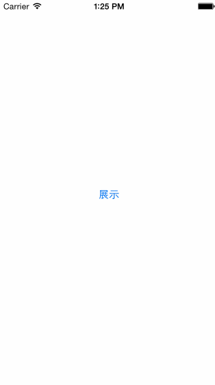
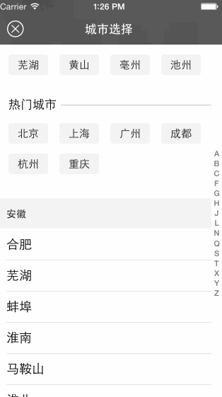
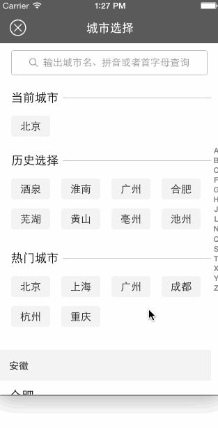
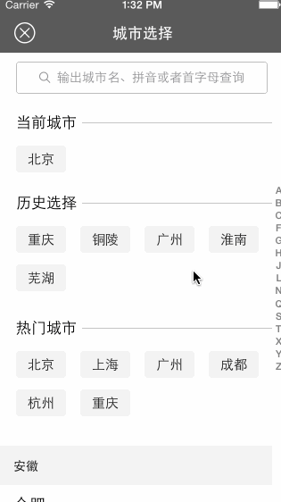
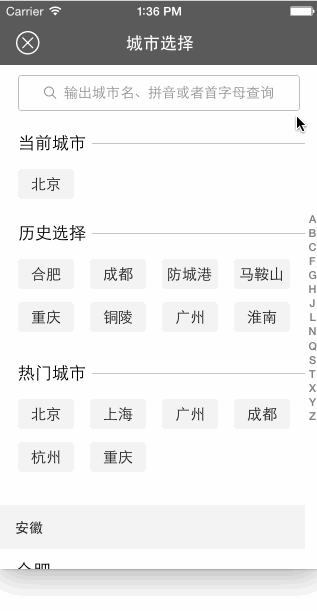
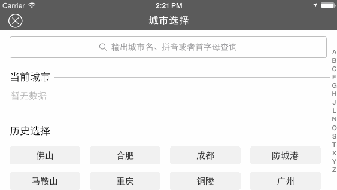

 

  

    Charlin出框架的目标：简单、易用、实用、高度封装、绝对解耦！

   
CFCityPickerVC
===============
城市选取控制器
Swift 1.2 
Xcode 6.3

    
框架说明
===============

注：请直接拖拽CFCityPickerVC文件夹到你的项目即可，由于城市具有中国特色，所以只有中文版本。不支持pod。

>1.原创框架，无需任何依赖，直接即可使用。 
>2.支持自动定位。 
>3.支持自定义热门城市。 
>4.支持自定义当前城市。 
>5.全部使用Closure回调，没有代理！ 
>6.支持ios 7.0及以上，支持横竖屏！ 

    
功能演示
===============

####1.基本展示
  

####2.索引展示：索引快速定位
  

####3.城市选择与回调：closure回调，请注意控制台打印
  

####4.历史选择：请注意历史城市与其排序
  

####5.自定义检索：自动回调，历史记录同样可用
  

####6.横屏支持
  

    
使用说明
===============
  
####1.导入
直接拖拽CFCityPickerVC文件夹到您项目中即可

由于是拖拽式，所以swift中的命名空间不能很好的发挥，所以框架有一定的前缀，不过在类的归属上，
我尽量使用了命名空间的原则。其中最明显的就是CityModel是使用了命名空间。 
>1.搜索框的cancel按钮如果需要中文，请添加中文多语言支持即可 
>2.iOS 8定位，请在info.plist 中添加NSLocationWhenInUseUsageDescription 说明文字

  
####2.model展示城市控制器
由于您的项目的导航栏肯定是定制的，所以我这里是让您自己来传您的NavVC，请不要直接modal框架中的CFCityPickerVC，不然会没有导航栏：

      
      let cityVC = CFCityPickerVC()
      //设置城市数据
      let cityModels = cityModelsPrepare()
      cityVC.cityModels = cityModels
      let navVC = UINavigationController(rootViewController: cityVC)
      navVC.navigationBar.barStyle = UIBarStyle.BlackTranslucent
      self.presentViewController(navVC, animated: true, completion: nil)

  注：这里的设置城市数据，你数据可以来自网络，我这里来自plist，由于目前swift中一键字典转模型工具还没有完善，所以是手动解析。

  
####3.设置当前城市：直接城市名即可，请不要带有【市】字，如：成都

    //设置当前城市
    cityVC.currentCity = "成都"
    
  注：当然你这里是可以不用设置的，框架有自动定位机制。如果你手动设置了当前城市，则不会触发自动定位。
  
  
####4.设置热门城市

      //设置热门城市
      cityVC.hotCities = ["北京","上海","广州","成都","杭州","重庆"]
      
  注：同样注意不要带有【市】字

  
####5.城市选中事件回调：Closure回调，无代理

      //选中了城市
      cityVC.selectedCityModel = { (cityModel: CFCityPickerVC.CityModel) in
        println("您选中了城市： \(cityModel.name)")
      }

   
结束语
===============
此框架基本是我前几天在去若尔盖草原旅游的漫长的长途汽车上完成的，在此纪念一下！

   
MIT
===============
此框架基于MIT协议开源

   

组织信息 Charlin Feng：
===============

注： 加群请随时关注群公告

 
#### 特别群：请西部省市朋友实名加入组织。其他地区朋友请添加3-4群：谢谢。
 
【西部区域】西部大开发群号： 473185026  -追赶北上广！为振兴西部IT而努力！ 
热烈欢迎中国西部各省市的从事iOS开发朋友实名进群！本群为是聚集西部零散开发者，大家齐心协力共进退！   

【全国可加】四群： 347446259 
新开，可加！欢迎全国朋友加入组织   

【全国可加】三群： 474377358 
新开，可加！欢迎全国朋友加入组织   

【全国可加】二群： 369870753 
**WARNING: 已爆满，加不上了**  

【全国可加】一群：163865401 
**WARNING: 已爆满，加不上了**  

  
